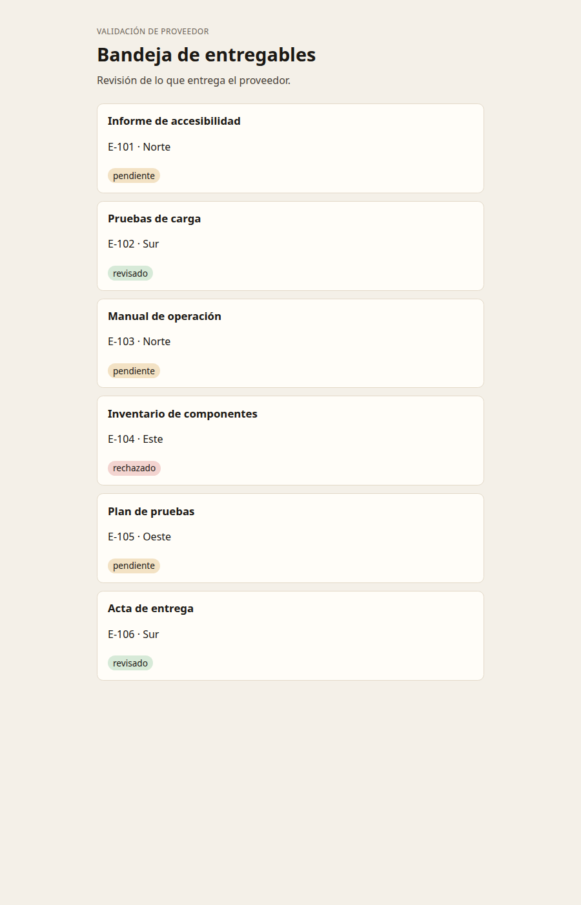

# M01 — Fundamentos de React

[← Página anterior](../../README.md) · [Siguiente página →](M01-01-entorno.md)

> [!NOTE]
> **Cómo funciona este módulo.** Primero la **teoría**, luego la **demostración guiada**, y después **practicas tú** en los laboratorios.

## Qué aprenderás

- Distinguir la página, la herramienta que la sirve y la librería que la dibuja.
- Leer JSX: qué es HTML y qué es JavaScript.
- Sacar un trozo de interfaz a un componente con props.

## Teoría

La bandeja es una interfaz que se queda en el navegador. El documento se descarga una vez. Cuando más adelante filtres o marques un entregable, React vuelve a pintar ese trozo. No hay una petición nueva de toda la página.

Tres piezas distintas, que conviene no mezclar:

| Pieza | Qué es aquí | Qué no es |
|-------|-------------|-----------|
| Node | El entorno que ejecuta las herramientas en la terminal | El servidor de la bandeja en producción |
| npm | El que instala lo que declara `package.json` | Un framework de interfaz |
| Vite | Sirve la app en el puerto 5173 y empaqueta para `build` | React |
| React | La librería que describe la interfaz y la actualiza | El empaquetador, el router o el backend |

JSX parece HTML escrito dentro de JavaScript. Es un formato que Vite transforma. Reglas que se ven en cuanto se lee `App.jsx`:

- Un componente es una función cuyo nombre empieza en mayúscula y que devuelve interfaz.
- Lo que va entre llaves es JavaScript: `{item.titulo}`.
- Algunos nombres cambian respecto a HTML: `class` pasa a ser `className`. El atributo `class` es palabra reservada en JavaScript.
- Una lista necesita `key` estable. Aquí es `item.id`, no la posición, porque la posición cambia al filtrar.

> [!NOTE]
> Un **elemento** es lo que React pinta (`<h1>`, `<li>`). Un **componente** es la función que devuelve elementos. `App` es un componente. El `<h1>` de dentro es un elemento.

Las **props** son los argumentos de esa función. El componente no pide los datos: los recibe. Un botón no decide el entregable; el padre se lo pasa y, si hay reacción, le pasa también una función.

```jsx
function Tarjeta({ item }) {
  return <h2>{item.titulo}</h2>
}
```

El evento es una prop más: `onClick={unaFuncion}`. No se escribe `onClick="unaFuncion()"` como en un atributo HTML clásico. Los paréntesis ejecutarían la función al pintar, no al pulsar.

> [!WARNING]
> Si la función se invoca en el sitio del `onClick` (`onClick={anotar()}`), se ejecuta en cada pintado. La referencia, sin paréntesis, espera al clic: `onClick={() => anotar(item.id)}`.

## Demostración guiada

Al abrir el Codespace, la carpeta `bandeja/` ya está instalada. En la terminal, dentro de esa carpeta, `npm run dev` deja Vite escuchando en el puerto 5173. El aviso de puerto del editor abre la bandeja en el navegador.

La pantalla muestra el título «Bandeja de entregables» y seis fichas. Cada ficha sale del array `entregables` de `src/datos.js`. En `App.jsx`, la función `Bandeja` recorre ese array con `map` y pinta título, identificador, proveedor y estado. `App` solo decide si toca la variante lenta.



La condición `lenta` de las primeras líneas de `App` abre otra pantalla si la dirección lleva `?lenta=1`. Esa pantalla se usa al medir rendimiento. La bandeja de trabajo es la otra rama.

En el código, el título de cada ficha es `{item.titulo}`: la llave sale del array al elemento. El botón todavía no está. La ficha es marcada dentro de `App`, no en un componente propio. Eso es lo que se separa en el tercer laboratorio.

## Ahora practica tú

| Lab | Título | Qué harás |
|-----|--------|-----------|
| M01-01 | [Entorno](M01-01-entorno.md) | Arrancar la bandeja en el puerto 5173 |
| M01-02 | [JSX y eventos](M01-02-jsx-y-eventos.md) | Añadir un botón que escribe el id en la consola |
| M01-03 | [Componentes](M01-03-componentes.md) | Extraer la ficha a un componente con props |

→ Empieza por **[M01-01 — Entorno](M01-01-entorno.md)**.
