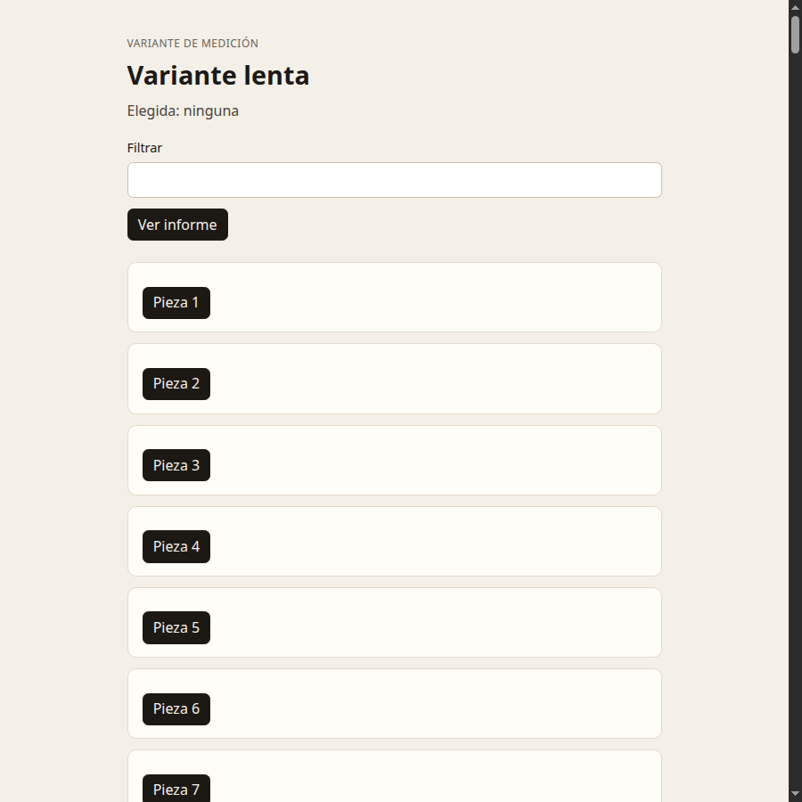

# M04 — Rendimiento

[← Página anterior](../M03-apis-y-arquitectura/M03-02-estructura.md) · [Siguiente página →](M04-01-medir.md)

> [!NOTE]
> **Cómo funciona este módulo.** Primero la **teoría**, luego la **demostración guiada**, y después **practicas tú** en los laboratorios.

## Qué aprenderás

- Leer una interacción lenta antes de cambiar código.
- Ver, en el Profiler, que un estado del padre vuelve a pintar a los hijos.
- Partir un panel que no hace falta en la primera descarga.

## Teoría

React pinta en dos momentos que el Profiler separa. **Render**: llama a tus funciones y calcula el árbol. **Commit**: aplica ese árbol al documento. Una función lenta dentro del componente alarga el render. Una lista enorme alarga los dos.

Si el estado vive en el padre, un `setTexto` vuelve a ejecutar al padre. Cada hijo se vuelve a ejecutar también, salvo que se lo impidas con una comparación de props. `memo` envuelve un componente y se salta el render si sus props son iguales (comparación superficial).

Esa comparación se rompe con facilidad:

| Prop que parece igual | Por qué `memo` no salta el render |
|-----------------------|------------------------------------|
| `estilo={{ padding: 4 }}` | Objeto nuevo en cada render del padre |
| `alPulsar={() => ...}` | Función nueva en cada render del padre |
| `item={item}` del mismo array | Esta sí se puede saltar: es la misma referencia |

`useCallback` y `useMemo` fijan la referencia de una función o de un valor. No aceleran nada por sí solos. Sirven cuando un hijo memorizado compara esa prop.

`lazy` parte el paquete. El componente no está en el JavaScript de la primera descarga. Llega cuando se renderiza, y `Suspense` muestra un respaldo mientras llega.

Tres herramientas, tres preguntas:

| Herramienta | Pregunta que responde |
|-------------|------------------------|
| React Profiler (extensión React DevTools) | Qué componente se ejecutó, cuántas veces y cuánto tardó el render |
| Performance, en las herramientas del navegador | Qué hace el hilo principal: script, pintura, layout |
| Lighthouse | Una pasada de carga: peso, bloqueo, contraste y otras reglas |

> [!NOTE]
> El Profiler no está en el navegador a secas. Hace falta la extensión [React DevTools](https://react.dev/learn/react-developer-tools) en el Chrome donde abres el puerto reenviado. Lighthouse y Performance sí vienen con las herramientas del navegador.

> [!WARNING]
> Optimizar la variante lenta no demuestra que la bandeja pequeña lo necesitara. Primero se mide. En la bandeja de seis fichas, `memo` no cambia nada que una persona note.

## Demostración guiada

La dirección con `?lenta=1` monta `ListaPesada` en lugar de la bandeja. Hay un filtro, un botón «Ver informe» y doscientas filas. Cada `Fila` hace trabajo de CPU en el render, a propósito.

Al escribir en «Filtrar», el estado `texto` cambia en `ListaPesada`. El padre se vuelve a ejecutar y, con él, cada `Fila`. El Profiler, grabando esa pulsación, muestra la lista de filas en el commit. La interacción se siente atrasada.

«Ver informe» muestra `Informe`, importado de forma estática al principio del archivo. Ese módulo viaja con la variante aunque nadie pulse el botón. Pasarlo a `lazy` lo saca de la primera descarga de esa pantalla y lo pide al pulsar.

## Ahora practica tú

| Lab | Título | Qué harás |
|-----|--------|-----------|
| M04-01 | [Medir](M04-01-medir.md) | Grabar un commit de la variante lenta con el Profiler |
| M04-02 | [Una optimización](M04-02-optimizar.md) | Evitar renders de filas y cargar el informe aparte |

→ Empieza por **[M04-01 — Medir](M04-01-medir.md)**.
